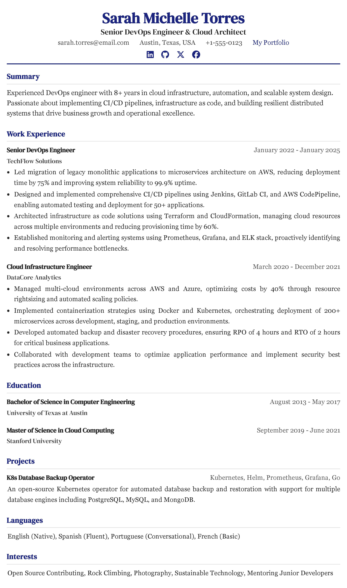
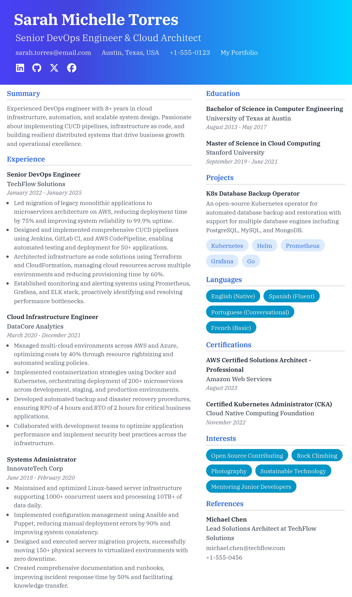
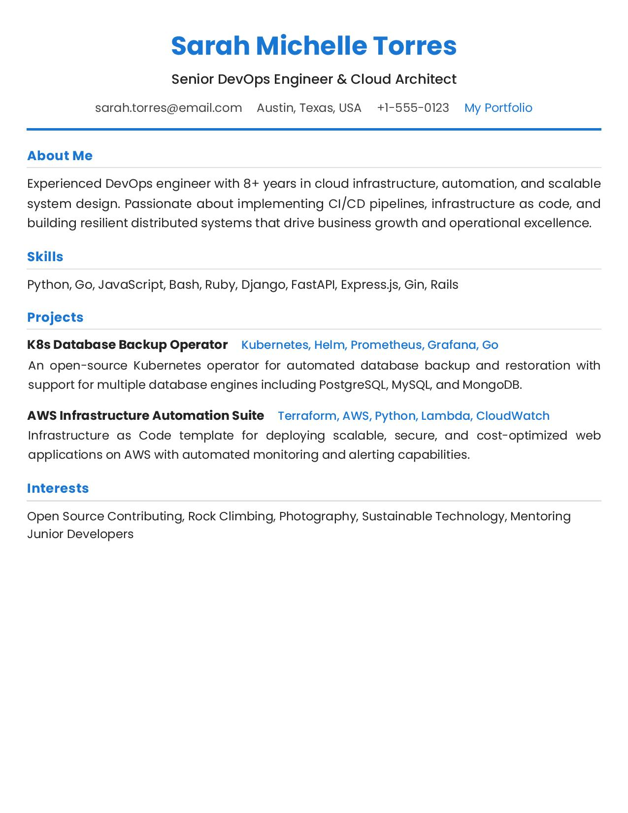
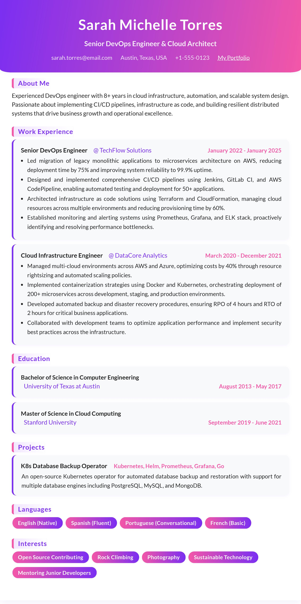
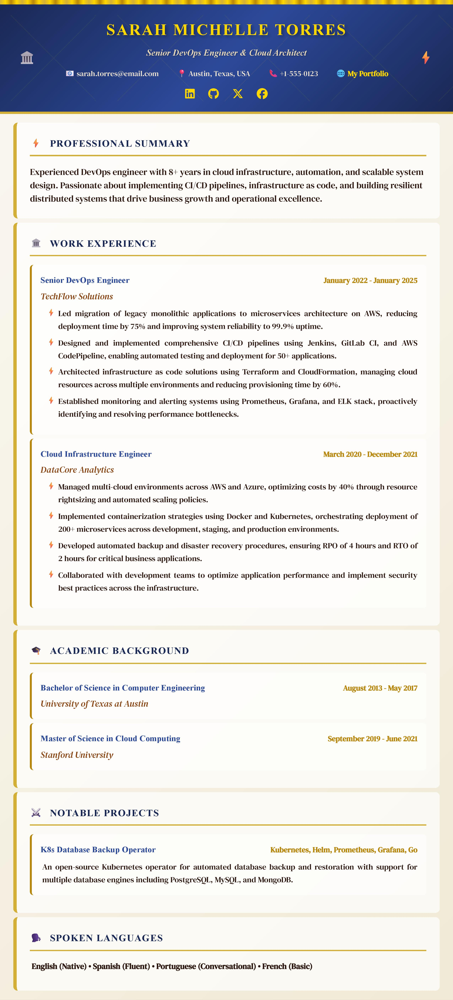
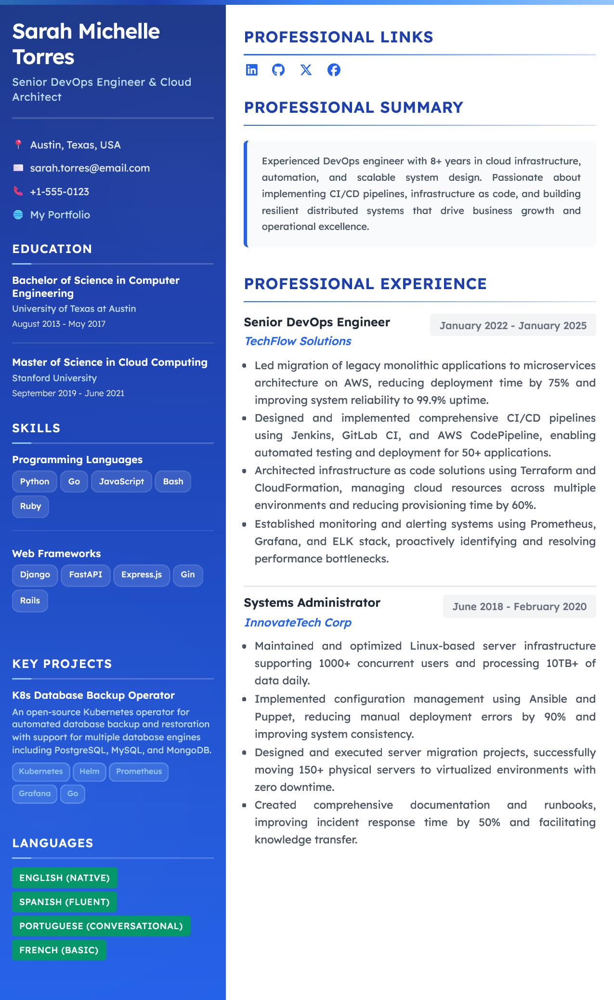
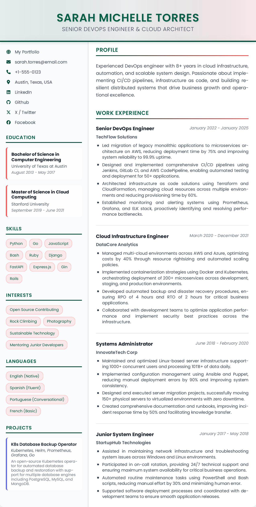
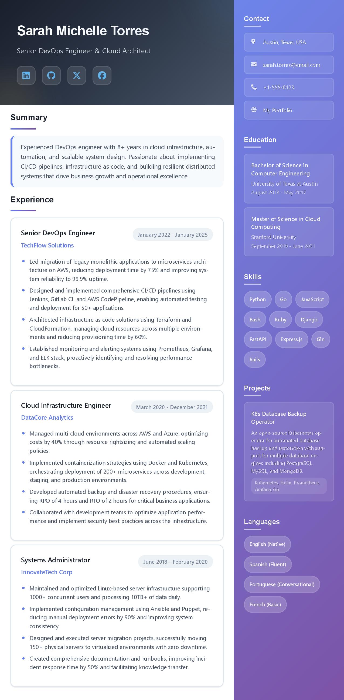
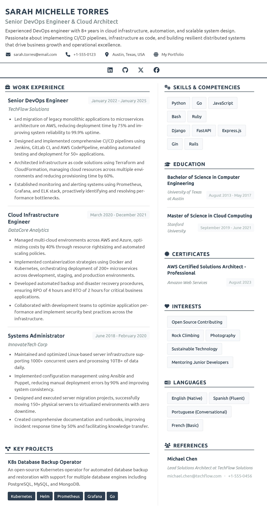
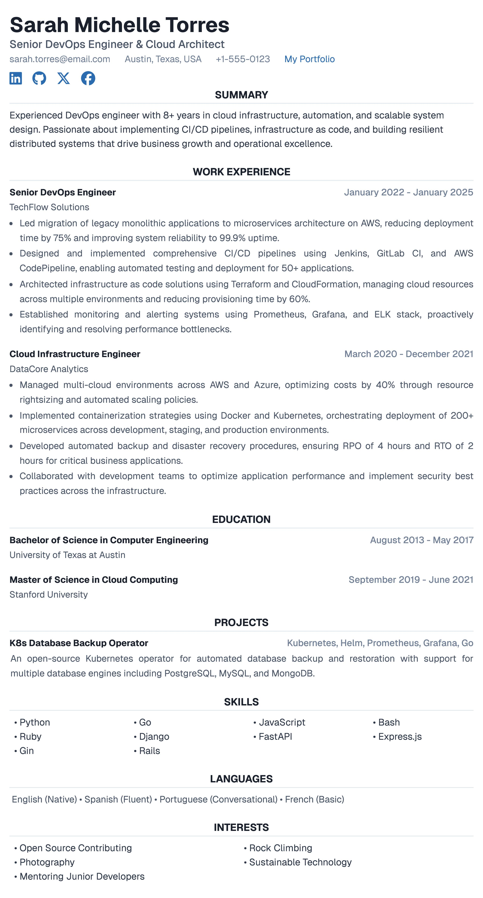

# 🎯 ResumeForge - Professional Resume Builder


A cutting-edge, responsive resume builder application built with React, TypeScript, and Tailwind CSS. Create stunning professional resumes with multiple premium templates, live preview, visual template selection, and export them as high-quality PDFs. Features modern authentication, protected routes, dark mode support, and an intuitive drag-and-drop interface.

## ✨ Key Features

### 🎨 **Premium Template Collections**
- **Galaxy Collection** (4 templates): Timeless professional designs perfect for traditional industries
  - Executive Classic, Modern Professional, Executive Minimal, Creative Professional
- **Greek Gods Collection** (6 templates): Commanding templates for modern leaders and ambitious professionals  
  - Zeus Executive, Athena Strategic, Apollo Creative, Artemis Focused, Hermes Dynamic, Hera Elegant

### 🚀 **Advanced Functionality**
- **Visual Template Selection**: Browse templates with actual resume snapshots as backgrounds
- **Live Preview**: Real-time resume preview as you edit with instant template switching
- **Smart Dashboard**: Grid and list views with template-based background previews
- **PDF Export**: High-quality PDF generation preserving template design and formatting
- **Drag & Drop Interface**: Intuitive content organization and section reordering
- **Rich Text Editor**: Advanced text editing with formatting options using TipTap
- **Form Validation**: Comprehensive validation using React Hook Form and Yup schemas

### 🔐 **Security & User Experience**
- **Authentication**: Secure login with Google, GitHub, and traditional email/password
- **Protected Routes**: Resume editing and template access require authentication
- **Local Storage**: Automatic data persistence with smart backup and recovery
- **Responsive Design**: Seamless experience across desktop, tablet, and mobile devices
- **Dark Mode**: Full dark/light theme support with system preference detection
- **Modern UI/UX**: Clean, professional interface with smooth animations and transitions

### 📊 **Data Management**
- **Resume Management**: Create, edit, clone, rename, and delete resumes
- **Template Switching**: Change templates without losing data
- **Auto-Save**: Automatic saving of progress with conflict resolution
- **Export Options**: Multiple export formats and quality settings

## 🛠️ Technologies & Architecture

### **Frontend Stack**
- **React 18.3.1**: Modern UI library with hooks and concurrent features
- **TypeScript 5.6.2**: Type safety and enhanced developer experience
- **Vite**: Lightning-fast development and optimized production builds
- **Tailwind CSS 4.1.8**: Utility-first CSS framework with custom design system

### **UI & Components**
- **Radix UI**: Accessible, unstyled UI primitives for complex components
- **Shadcn/UI**: Beautiful, reusable components built on Radix UI
- **Lucide React**: Modern icon library with consistent design
- **TipTap**: Rich text editor with extensive formatting capabilities

### **Form & Validation**
- **React Hook Form**: Performant forms with minimal re-renders
- **Yup**: Schema validation with TypeScript integration
- **Zod**: Runtime type validation for API responses

### **State Management & Storage**
- **Redux Toolkit**: Predictable state management with modern patterns
- **Zustand**: Lightweight state management for UI state
- **Local Storage**: Client-side persistence with encryption support

### **PDF & Export**
- **React PDF**: PDF generation with template preservation
- **HTML2Canvas**: High-quality screenshot generation
- **JSZip**: Archive creation for bulk exports

## 🎨 Template Gallery

> **📝 Note**: The resume templates shown below contain AI-generated mock data for demonstration purposes only. The actual application allows you to input your own personal information and customize all content according to your professional background and preferences.

### Galaxy Collection - Timeless Professional Designs

<div style="display: grid; grid-template-columns: repeat(2, 1fr); gap: 20px; margin: 20px 0;">

<div>

#### Executive Classic (Cigar)


*Sophisticated template designed for senior professionals and executives seeking timeless elegance.*

</div>

<div>

#### Modern Professional (Andromeda)


*Modern design that balances innovation with professionalism for today's dynamic workplace.*

</div>

<div>

#### Executive Minimal (Comet)


*Refined minimalism that lets your achievements speak through sophisticated simplicity.*

</div>

<div>

#### Creative Professional (Milky Way)


*Innovative design showcasing creativity while maintaining professional standards.*

</div>

</div>

### Greek Gods Collection - Legendary Power & Wisdom

<div style="display: grid; grid-template-columns: repeat(2, 1fr); gap: 20px; margin: 20px 0;">

<div>

#### Zeus Executive


*Command authority and respect with this powerful template for C-suite executives.*

</div>

<div>

#### Athena Strategic


*Showcase strategic thinking with this sophisticated design for consultants and analysts.*

</div>

<div>

#### Apollo Creative


*Illuminate creative talents with this inspiring template for artists and designers.*

</div>

<div>

#### Artemis Focused


*Sharp, precise, goal-oriented design for accuracy-focused professionals.*

</div>

<div>

#### Hermes Dynamic


*Fast-paced template for sales professionals and dynamic business leaders.*

</div>

<div>

#### Hera Elegant


*Sophisticated elegance for senior management and executive positions.*

</div>

</div>

## 🚀 Getting Started

### Prerequisites

- **Node.js** (v18 or later)
- **npm** or **yarn** or **pnpm**
- Modern web browser with ES2020+ support

### Installation

1. **Clone the repository**
   ```bash
   git clone https://github.com/yourusername/resume-builder.git
   cd resume-builder
   ```

2. **Install dependencies**
   ```bash
   npm install
   # or
   yarn install
   # or
   pnpm install
   ```

3. **Set up environment variables**
   ```bash
   cp .env.example .env
   # Edit .env with your configuration
   ```

4. **Start the development server**
   ```bash
   npm run dev
   # or
   yarn dev
   # or
   pnpm dev
   ```

5. **Open your browser** and navigate to `http://localhost:5173`

## 📖 Usage Guide

### Quick Start
1. **Authentication**: Sign in with Google, GitHub, or create an account
2. **Create Resume**: Click "Create New Resume" from the dashboard
3. **Fill Information**: Complete the comprehensive resume form with your details
4. **Choose Template**: Browse and select from 10 premium templates with visual previews
5. **Live Preview**: Watch your resume update in real-time as you edit
6. **Export**: Download your professional PDF when satisfied

### Advanced Features
- **Template Switching**: Change templates without losing data
- **Section Reordering**: Drag and drop sections to customize layout
- **Rich Text Editing**: Format text with bold, italic, lists, and more
- **Resume Management**: Create multiple resumes, clone, rename, and organize
- **Dark Mode**: Toggle between light and dark themes

### Dashboard Features
- **Grid/List Views**: Switch between visual grid and detailed list views
- **Template Previews**: See actual resume snapshots as card backgrounds
- **Quick Actions**: Clone, rename, delete resumes with hover actions
- **Search & Filter**: Find resumes quickly with built-in search

## 📄 PDF Export

Advanced PDF generation system that:
- **Preserves Design**: Maintains exact template styling and formatting
- **High Quality**: Vector-based rendering for crisp, professional output
- **ATS Compatible**: Ensures compatibility with Applicant Tracking Systems
- **Multiple Formats**: Support for various paper sizes and orientations
- **Batch Export**: Export multiple resumes simultaneously

## 📁 Project Structure

```
resumeforge/
├── 📁 public/                    # Static assets and favicon
├── 📁 src/
│   ├── 📁 api/                   # API utilities and axios configuration
│   │   ├── axiosInstance.ts      # Configured axios client
│   │   └── endpoints.ts          # API endpoint definitions
│   ├── 📁 assets/               # Static assets and images
│   │   ├── 📁 snapshots/        # Template preview images
│   │   │   ├── 📁 galaxy/       # Galaxy collection snapshots
│   │   │   │   ├── andromeda.jpg
│   │   │   │   ├── cigar.jpg
│   │   │   │   ├── comet.jpg
│   │   │   │   └── milky-way.jpg
│   │   │   └── 📁 greek/        # Greek Gods collection snapshots
│   │   │       ├── apollo.jpg
│   │   │       ├── artemis.jpg
│   │   │       ├── athena.jpg
│   │   │       ├── hera.jpg
│   │   │       ├── hermes.jpg
│   │   │       └── zeus.jpg
│   │   └── 📁 icons/            # Application icons and logos
│   ├── 📁 components/           # Reusable React components
│   │   ├── 📁 blocks/           # Layout building blocks
│   │   ├── 📁 editor/           # Rich text editor components
│   │   ├── 📁 forms/            # Resume form sections
│   │   │   ├── PersonalInfo.tsx
│   │   │   ├── Experience.tsx
│   │   │   ├── Education.tsx
│   │   │   ├── Skills.tsx
│   │   │   └── ...
│   │   ├── 📁 templates/        # Resume template components
│   │   │   ├── 📁 galaxy/       # Galaxy collection templates
│   │   │   │   ├── andromeda.tsx
│   │   │   │   ├── cigar.tsx
│   │   │   │   ├── comet.tsx
│   │   │   │   └── milky-way.tsx
│   │   │   └── 📁 greek/        # Greek Gods collection templates
│   │   │       ├── apollo.tsx
│   │   │       ├── artemis.tsx
│   │   │       ├── athena.tsx
│   │   │       ├── hera.tsx
│   │   │       ├── hermes.tsx
│   │   │       └── zeus.tsx
│   │   ├── 📁 ui/               # Shadcn/UI components
│   │   ├── TemplateCard.tsx     # Template selection card with background images
│   │   ├── ResumeForm.tsx       # Main resume editing form
│   │   └── ...
│   ├── 📁 contexts/             # React context providers
│   │   └── ThemeContext.tsx     # Dark/light theme management
│   ├── 📁 lib/                  # Utility libraries
│   │   └── utils.ts             # Common utility functions
│   ├── 📁 pages/                # Main application pages
│   │   ├── Dashboard.tsx        # Resume management dashboard
│   │   ├── Templates.tsx        # Template selection with visual previews
│   │   ├── Editor.tsx           # Resume editing interface
│   │   ├── Preview.tsx          # Live resume preview
│   │   └── Auth.tsx             # Authentication pages
│   ├── 📁 schema/               # Validation schemas
│   │   └── resumeSchema.ts      # Yup validation rules
│   ├── 📁 store/                # State management
│   │   ├── useDashboardStore.ts # Dashboard state (Zustand)
│   │   └── useMainStore.ts      # Main app state (Zustand)
│   ├── 📁 styles/               # CSS and styling
│   │   ├── 📁 templates/        # Template-specific styles
│   │   │   ├── 📁 galaxy/       # Galaxy collection styles
│   │   │   └── 📁 greek/        # Greek Gods collection styles
│   │   ├── globals.css          # Global styles and Tailwind imports
│   │   └── components.css       # Component-specific styles
│   ├── 📁 types/                # TypeScript type definitions
│   │   ├── index.ts             # Main type exports
│   │   ├── resume.ts            # Resume data types
│   │   └── template.ts          # Template configuration types
│   ├── 📁 utils/                # Helper utilities
│   │   ├── templates-type.ts    # Template definitions and metadata
│   │   ├── helper.ts            # Common helper functions
│   │   └── pdf-export.ts        # PDF generation utilities
│   ├── App.tsx                  # Main application component
│   ├── main.tsx                 # Application entry point
│   └── routes.tsx               # Route definitions with lazy loading
├── 📄 package.json              # Dependencies and scripts
├── 📄 tsconfig.json             # TypeScript configuration
├── 📄 tailwind.config.js        # Tailwind CSS configuration
├── 📄 vite.config.ts            # Vite build configuration
└── 📄 README.md                 # Project documentation
```

## 🔧 Development

### Build Commands

```bash
# Development server with hot reload
npm run dev

# Type checking
npm run type-check

# Linting
npm run lint

# Production build
npm run build

# Preview production build
npm run preview
```

### Environment Variables

```bash
# .env
VITE_API_BASE_URL=http://localhost:3000
VITE_GOOGLE_CLIENT_ID=your_google_client_id
VITE_GITHUB_CLIENT_ID=your_github_client_id
```

### Code Quality

- **ESLint**: Configured with React and TypeScript rules
- **Prettier**: Code formatting with consistent style
- **TypeScript**: Strict mode enabled for type safety
- **Husky**: Pre-commit hooks for code quality

## 🤝 Contributing

We welcome contributions! Please follow these steps:

1. **Fork** the repository
2. **Create** your feature branch (`git checkout -b feature/amazing-feature`)
3. **Commit** your changes (`git commit -m 'Add amazing feature'`)
4. **Push** to the branch (`git push origin feature/amazing-feature`)
5. **Open** a Pull Request

### Contribution Guidelines

- Follow the existing code style and conventions
- Add tests for new features
- Update documentation for significant changes
- Ensure all tests pass before submitting
- Write clear, descriptive commit messages

## 📝 Recent Updates

### Version 2.0.0 - Visual Template Redesign

- ✨ **Visual Template Selection**: Browse templates with actual resume snapshots as backgrounds
- 🎨 **Enhanced Template Gallery**: Redesigned Templates page with blur effects and improved layout
- 📊 **Smart Dashboard**: Grid view now displays template backgrounds for each resume
- 🔧 **Improved UX**: Better hover effects, smooth transitions, and responsive design
- 🐛 **Bug Fixes**: Fixed button scaling issues and improved template switching

## 📄 License

This project is licensed under the **MIT License** - see the [LICENSE](./LICENSE) file for details.

## 🙏 Acknowledgments

### Core Technologies
- [**React**](https://react.dev/) - The library for web and native user interfaces
- [**TypeScript**](https://www.typescriptlang.org/) - JavaScript with syntax for types
- [**Vite**](https://vitejs.dev/) - Next generation frontend tooling
- [**Tailwind CSS**](https://tailwindcss.com/) - Utility-first CSS framework

### UI & Components
- [**Radix UI**](https://www.radix-ui.com/) - Low-level UI primitives
- [**Shadcn/UI**](https://ui.shadcn.com/) - Beautifully designed components
- [**Lucide React**](https://lucide.dev/) - Beautiful & consistent icons
- [**TipTap**](https://tiptap.dev/) - Headless rich text editor

### Development Tools
- [**React Hook Form**](https://react-hook-form.com/) - Performant, flexible forms
- [**Yup**](https://github.com/jquense/yup) - Schema validation
- [**Zustand**](https://github.com/pmndrs/zustand) - State management
- [**React PDF**](https://react-pdf.org/) - PDF generation for React

---

<div align="center">

**Built with ❤️ for professionals who deserve better resumes**

[🚀 Get Started](#-getting-started) • [📖 Documentation](#-usage-guide) • [🎨 Templates](#-template-gallery) • [🤝 Contribute](#-contributing)

</div>
